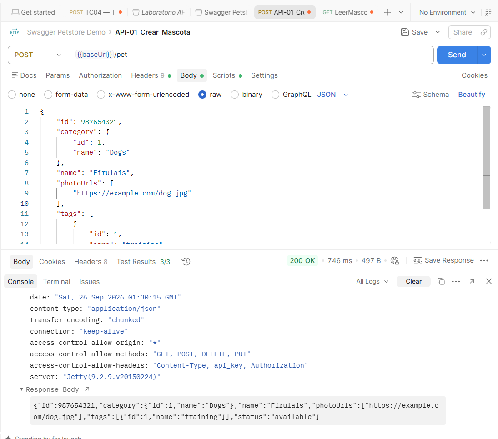

# API Testing — Casos de prueba

## Caso API-01: Creación exitosa de una mascota (POST)

**Objetivo:** Verificar que la API permita registrar una nueva mascota con una estructura JSON válida, respondiendo con status 200 y retornando la información persistida.
**Operación y endpoint:** `POST {{baseUrl}}/pet`
**Precondiciones:** Ninguna.
**Datos de entrada:** 
    * **Headers:** `Content-Type: application/json`
    * **Body (raw JSON):**
        ```json
        {
            "id": 987654321,
            "category": {
                "id": 1,
                "name": "Dogs"
            },
            "name": "Firulais",
            "photoUrls": [
                "https://example.com/dog.jpg"
            ],
            "tags": [
                {
                    "id": 1,
                    "name": "training"
                }
            ],
            "status": "available"
        }
        ```
**Resultado esperado:** Código HTTP `200 OK`. El cuerpo de respuesta devuelve el JSON confirmando el `id` 987654321 y el `name` "Firulais".
**Resultado obtenido:** `200 OK`. La mascota fue creada y la respuesta contiene la estructura persistida.
**Evidencia:** 

---

## Caso API-02
**Objetivo:**
**Operación y endpoint:**
**Precondiciones:**
**Datos de entrada:**
**Resultado esperado:**
**Resultado obtenido:**
**Evidencia:**

# Conclusiones
## Resultados relevantes
¿Qué resultados consideras más importantes y por qué?
## Limitaciones
¿Qué aspectos no pudiste verificar?
## Pruebas adicionales
¿Qué otras pruebas realizarías si tuvieras más tiempo?