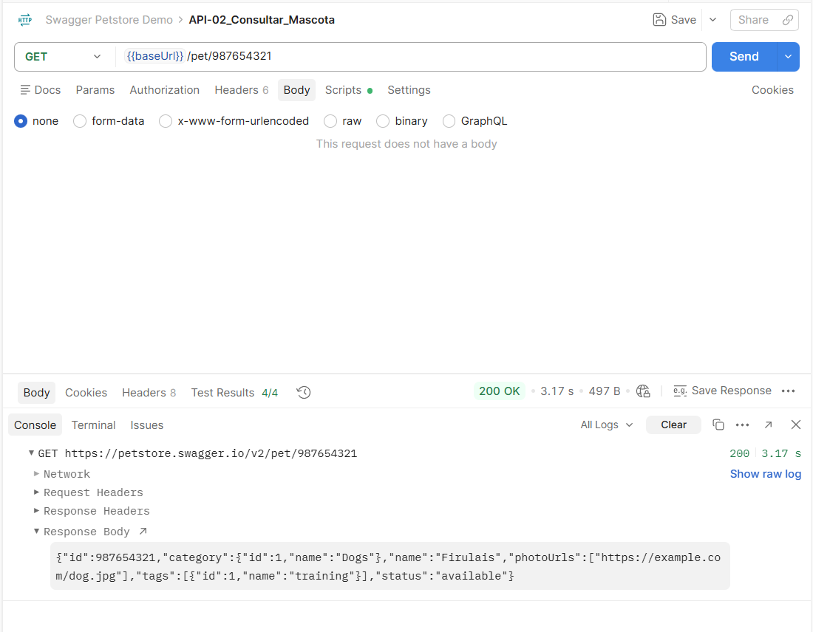
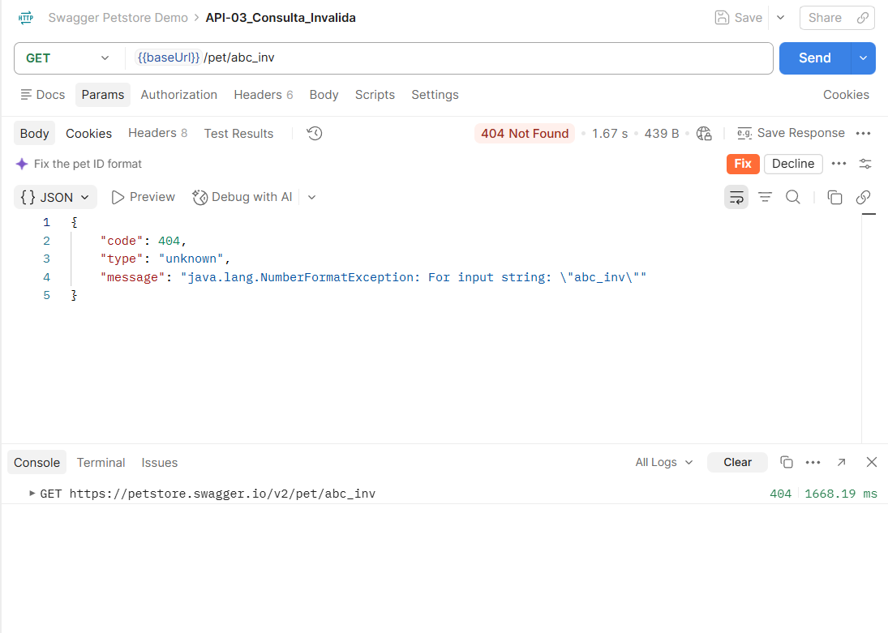
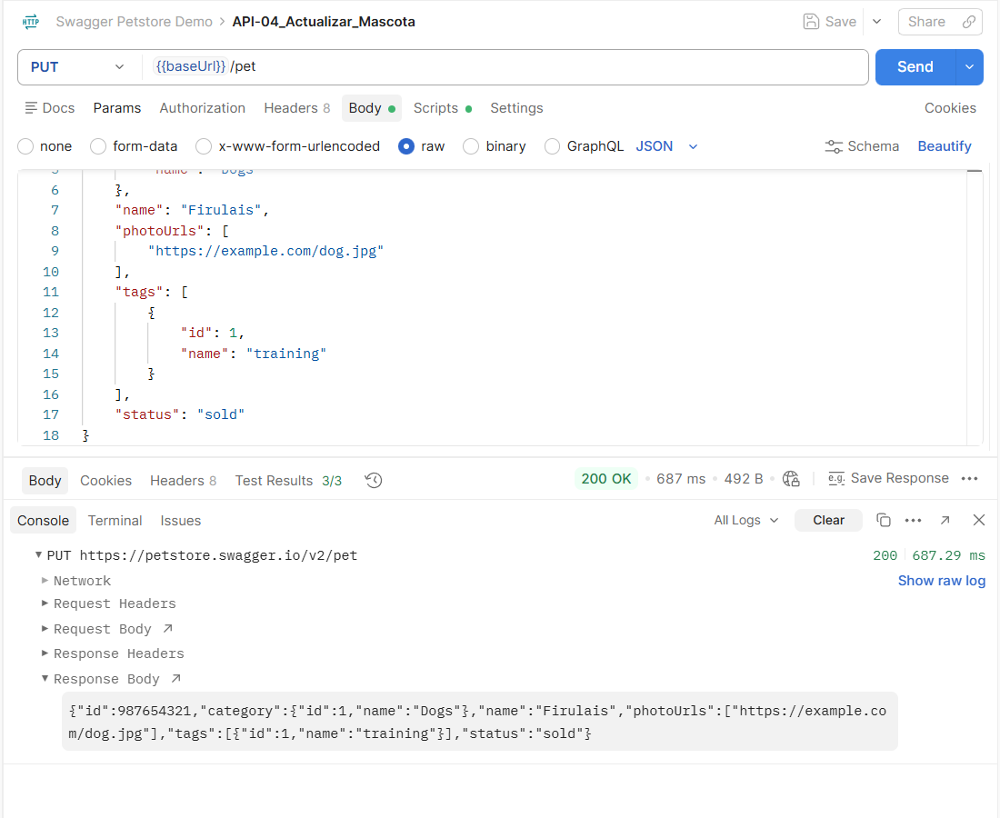
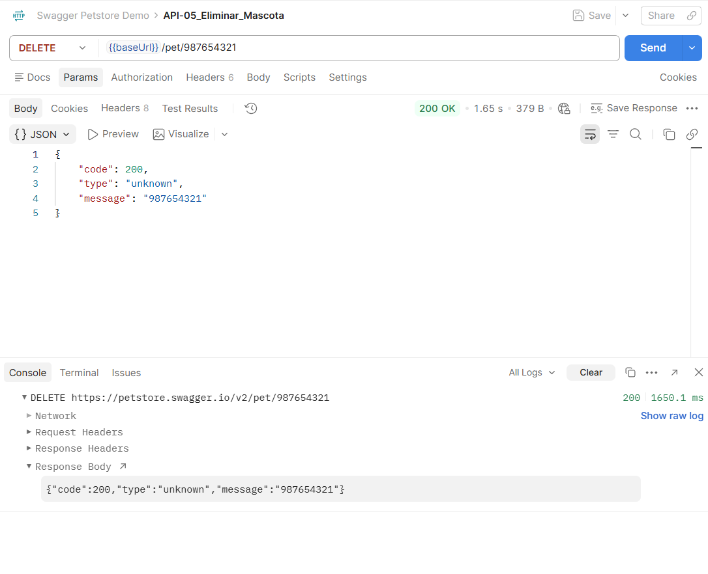
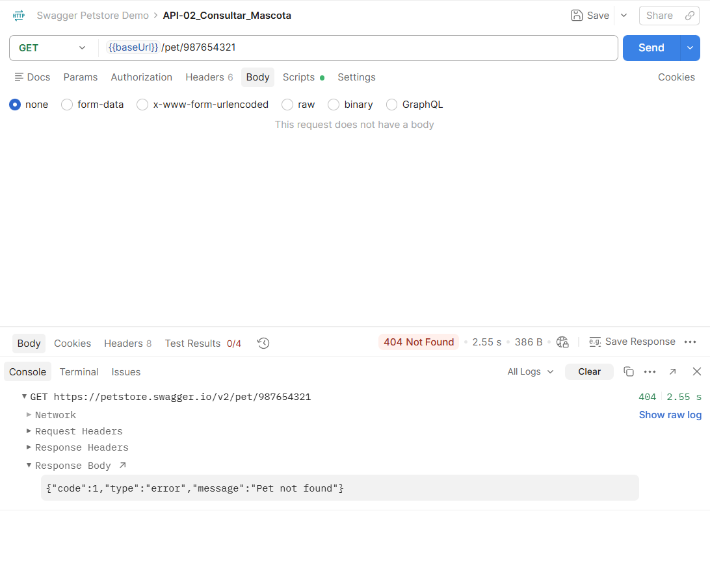
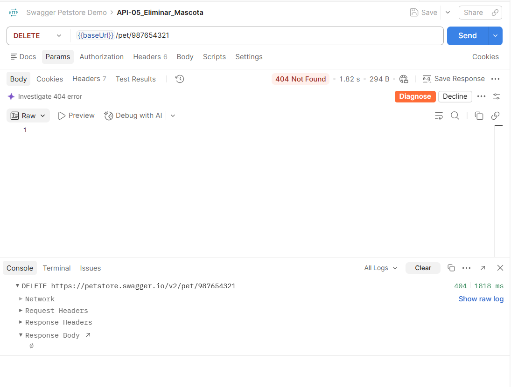

# API Testing — Casos de prueba

## Caso API-01: Creación exitosa de una mascota (POST)

* **Objetivo:** Verificar que la API permita registrar una nueva mascota con una estructura JSON válida, respondiendo con status 200 y retornando la información persistida.

* **Operación y endpoint:** `POST {{baseUrl}}/pet`

* **Precondiciones:** Ninguna.

* **Datos de entrada:** 

    * **Headers:** `Content-Type: application/json`

    * **Body (raw JSON):**
```json
{
"id": 987654321,
"category": {
    "id": 1,
    "name": "Dogs"
},
"name": "Firulais",
"photoUrls": [
    "https://example.com/dog.jpg"
],
"tags": [
    {
    "id": 1,
    "name": "training"
    }
],
"status": "available"
}
```

* **Resultado esperado:** Código HTTP `200 OK`. El cuerpo de respuesta devuelve el JSON confirmando el `id` 987654321 y el `name` "Firulais".

* **Resultado obtenido:** `200 OK`. La mascota fue creada y la respuesta contiene la estructura persistida.

* **Evidencia:** 


---

## Caso API-02: Consulta de mascota por identificador existente (GET)

* **Objetivo:** Validar la consulta exitosa de una mascota registrada previamente utilizando su ID numérico.

* **Operación y endpoint:** `GET {{baseUrl}}/pet/987654321`

* **Precondiciones:** Haber ejecutado exitosamente el Caso API-01 con el ID 987654321.

* **Datos de entrada:** Parámetro de ruta `petId = 987654321`.

* **Resultado esperado:** Código HTTP `200 OK`. El cuerpo de respuesta contiene el nombre "Firulais" y el estado "available".

* **Resultado obtenido:** `200 OK`. Los datos coinciden con la información registrada en el sistema.

* **Evidencia:** 



---

## Caso API-03: Consulta con identificador no numérico / inválido (GET Negativo)

* **Objetivo:** Verificar el comportamiento defensivo de la API al solicitar un recurso con un tipo de dato incompatible en la URL.

* **Operación y endpoint:** `GET {{baseUrl}}/pet/abc_inv`

* **Precondiciones:** Ninguna.

* **Datos de entrada:** Parámetro de ruta `petId = abc_inv`.

* **Resultado esperado:** Código HTTP `404 Not Found` o `400 Bad Request` informando que el parámetro es inválido o no existe, sin generar un error 500 no controlado.

* **Resultado obtenido:** `404 Not Found`. El servidor rechaza la solicitud de forma controlada.

* **Evidencia:** 



---

## Caso API-04: Actualización de estado e información de mascota (PUT)

* **Objetivo:** Verificar que la API permite actualizar atributos de una mascota existente (cambio de estado de `available` a `sold`).

* **Operación y endpoint:** `PUT {{baseUrl}}/pet`

* **Precondiciones:** La mascota con ID 987654321 debe existir previamente en el sistema.

* **Datos de entrada:**

  * **Headers:** `Content-Type: application/json`

  * **Body (raw JSON):**

    ```json
    {
      "id": 987654321,
      "category": { "id": 1, "name": "Dogs" },
      "name": "Firulais",
      "photoUrls": ["https://example.com/dog.jpg"],
      "tags": [{ "id": 1, "name": "training" }],
      "status": "sold"
    }
    ```
* **Resultado esperado:** Código HTTP `200 OK`. La respuesta refleja el campo `status` actualizado a "sold".

* **Resultado obtenido:** `200 OK`. El estado fue modificado exitosamente.

* **Evidencia:** 



---

## Caso API-05: Eliminación de mascota existente y confirmación de baja (DELETE)

* **Objetivo:** Comprobar que la operación DELETE remueve la mascota del registro y que posteriores consultas GET devuelven un código 404.

* **Operación y endpoint:** `DELETE {{baseUrl}}/pet/987654321`

* **Precondiciones:** La mascota con ID 987654321 debe existir en el sistema.

* **Datos de entrada:** Parámetro de ruta `petId = 987654321`.

* **Resultado esperado:** Código HTTP `200 OK` confirmando la eliminación del recurso.

* **Resultado obtenido:** `200 OK`. El recurso fue removido del sistema.

* **Evidencia:** 




---

## Caso API-06: Intento de eliminación de mascota inexistente (DELETE Negativo)

* **Objetivo:** Verificar que la API maneja defensivamente el intento de eliminación de un ID inexistente sin fallos internos en el servidor.

* **Operación y endpoint:** `DELETE {{baseUrl}}/pet/987654321`

* **Precondiciones:** El identificador no debe existir en la base de datos de la API.

* **Datos de entrada:** Parámetro de ruta `petId = 987654321`.

* **Resultado esperado:** Código HTTP `404 Not Found` informando que el recurso no fue encontrado.

* **Resultado obtenido:** `404 Not Found`. El sistema devuelve código de error controlado.

* **Evidencia:** 



---

# Conclusiones

## Resultados relevantes
El ciclo completo de vida del recurso `pet` (Crear -> Consultar -> Modificar -> Eliminar) opera de acuerdo con los estándares REST esperados en escenarios positivos (códigos 200). En las pruebas negativas, la API responde con códigos controlados (404), evitando caídas no controladas del servicio (errores 500). Sin embargo, se evidenció que la API permite editar y borrar cualquier registro sin autenticación, lo que en una tienda real causaría pérdida de datos.

## Limitaciones

Solo se validó la respuesta externa desde Postman, sin acceso a la base de datos ni a los registros del servidor.

## Pruebas adicionales
Con mayor disponibilidad de tiempo, seria:

1. Probar nombres con caracteres extraños, muy largos o vacíos en el registro.

2. Probar si se puede generar un pedido de una mascota inexistente o eliminada.

3. Dejar los tests configurados para correr automáticamente en secuencia en Postman.